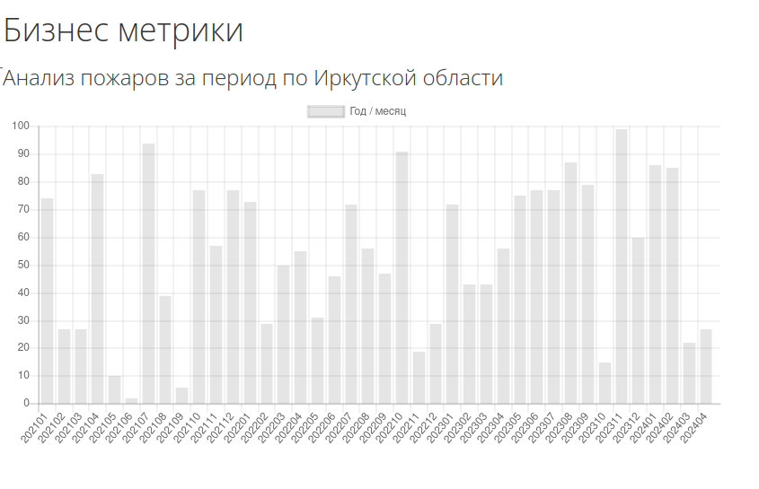

# Sample4

### Подготовка
1. Создаем решение (sln)
```bash
dotnet new sln -o GeoJsonWeb
```

2. Добавляем новый проект (Rest Api)
```bash
dotnet new webapi --name GeoJsonWeb
```


### JS
https://www.chartjs.org/docs/latest/getting-started/usage.html

### Результат


#### Задание
1. Необходимо на основе примера [Sample3](../Sample3/GeoJsonStorage/) подключить данные получаемые из PostgreSQL
Данные по фактическим пожарам в Иркутской области.

```
  var result = await convertor.Load(fileName);
        if(result)
        {
            ConsoleWrite($"Данные из файла {fileName} загружены успешно.");
            var history = convertor.CreateFireHistory();
            await storage.Save(history);
            ConsoleWrite("Загрузка данный завершена.");
        }
```

2. Сформировать набор данных в базе данных `fires_history` с набором данных о планируемом результате по пожарам в Иркутской области.
3. Реализовать новый контроллер, который будет возвращать данные.
4. Доработать пример `index.html`. Подключить второй набор данных, желательно на одном графике.


