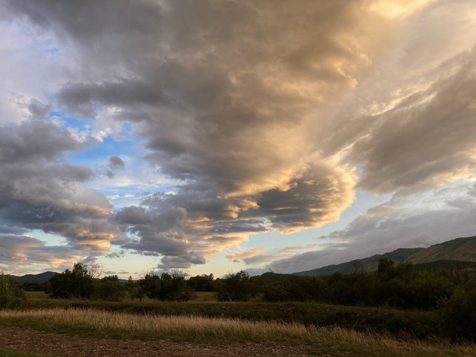
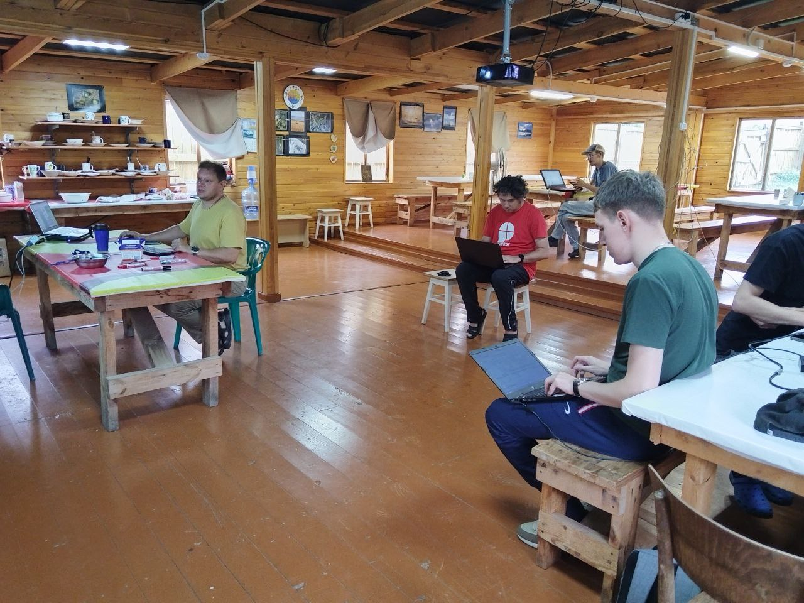

# Методические материалы
### Курс `Бизнес метрики` - САРМА 2024

Редакция: `2024-07-01`

- [Исходная документация](Docs)

#### Программа

| День                | Описание                                                       |
|---------------------|----------------------------------------------------------------|
| 20/08/2024          | Знакомство с платформой `Microsoft`, `C#`, `Net`               |
| `вечер`             | Установка и настройка окружения.                               |
| | |
| 21/08/2024          | Разработка первого консольного приложения.                     |
| `утро`              | Обработка файлов геолокации. Конвертация данных.               |
|[Sample1](Sample1)   |                                                                |
| | |
| `вечер`             | Проверка задания. Демонстрация готового решения.                |
|                     | Знакомство с `DevOps` практикой. Запуск приложения в `Docker`   |
|[Sample2](Sample2)   | консольного приложения. Постановка новой задачи.                |
| | |
| 22/08/2024          | Проверка задания. Демонстрация готового решения.                |
| `утро`              | Знакомство с `PostgreSQL`, `Ansi SQL`. Запуск приложения в `Docker` |
|                     | Проектирование базы данных. Постановка новой задачи.            |
| | | 
| `вечер`             | Проверка задания. Демонстрация готового решения.                |
|[Sample3](Sample3)   | Работа с базой данный с использованием `ADO.net`                |
| | |                                  
| 23/08/2024          | Проверка задания. Демонстрация готового решения.                 |
| `утро`              | Знакомство с `RestApi`, `ChartJs`. Формируем график распрастранения пожаров  |
[Sample4](Sample4)    | Постановка новой задачи.                                         |
| | | 
| `вечер`             | Проверка задания. Технические консультации.                      |
|                     | Финальная демонстрация работ `Бизнес метрики`                    |
| | |
 
### Результаты

|               |                |
|---------------|----------------|
|  |  |
|  |  |
|  |  |
| | | 

#### Спонсор
- [ИТ1](https://www.it-one.ru/)

 

